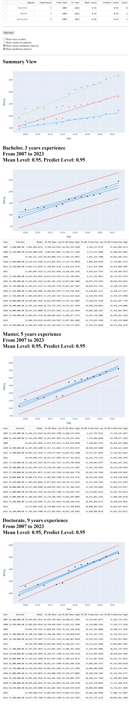

# Instructions

Install micromamba as described at

```
https://mamba.readthedocs.io/en/latest/installation/micromamba-installation.html
```

Create an environment.  Replace [env_name] with your own choosing.

```
micromamba env create -n [env_name] -f requirements.txt
```

Activate the environment.

```
micromamba activate [env_name]
```

Run the main script.

```
python main.py
```

Access the local hosted web at

```
http://127.0.0.1:8050/
```

# Preview


